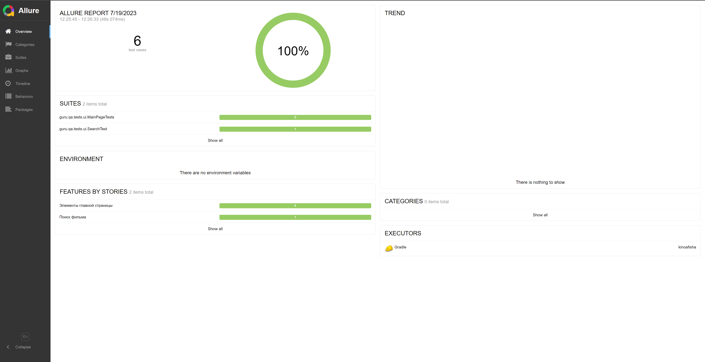
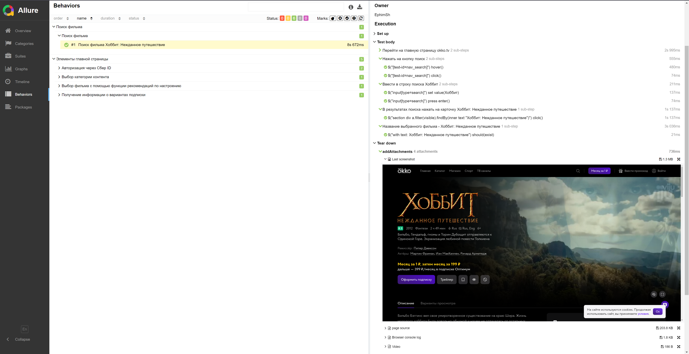
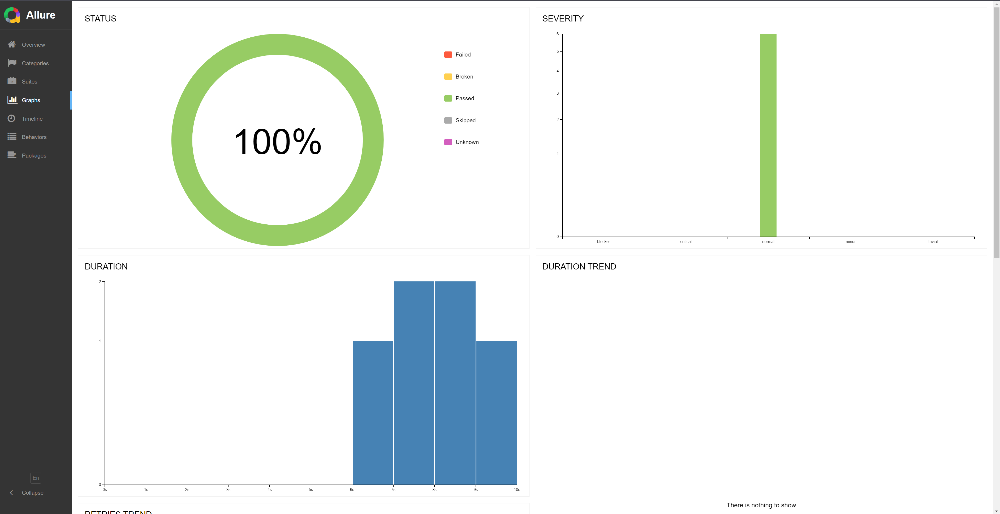

# Проект по автоматизации UI-тестов сайта okko.tv

> okko.tv - Российский стриминговый сервис, по состоянию на 2023 г. занимает четвертое место среди российских онлайн-кинотеатров по количеству подписчиков.

## Использованный стек технологий
<p align="center">


</p>

- В данном проекте автотесты написаны на языке <code>Java</code> с использованием фреймворка для тестирования Selenide. 
- В качестве сборщика был использован - <code>Gradle</code>.  
- Использованы фреймворки <code>JUnit 5</code> и [Selenide](https://selenide.org/).
- При прогоне тестов браузер запускается в [Selenoid](https://aerokube.com/selenoid/).
- Для "удаленного" запуска, локально был поднят docker с selenoid на wsl ubuntu


Содержание Allure-отчета:
* Шаги теста;
* Скриншот страницы на последнем шаге;
* Page Source;
* Логи браузерной консоли;
* Видео выполнения автотеста.


## Содержание:
- [Запуск автотестов](#arrow_forward-Запуск-автотестов)
- [Пример Allure-отчета](#-Пример-Allure-отчета)
- [Уведомления в Telegram с использованием бота](#-Уведомления-в-Telegram-с-использованием-бота)
- [Видео примера запуска тестов в Selenoid](#-видео-примера-запуска-теста-в-Selenoid)


## Запуск автотестов

### Возможнный запуск тестов из терминала
```
gradle clean web_test
gradle clean web_test -Denv=remote
```
Для удаленного запуска тестов <code>Selenoid</code>.
необходимо поменять remoteUrl на ваш, в ./src/test/resources/remote.properties

##  Пример Allure-отчета
### Overview

<p align="center">

</p>

### Тест-кейсы

<p align="center">

</p>

<p align="center">

</p>

### Графики

<p align="center">

</p>


##  Уведомления в Telegram с использованием бота

После завершения тестов бот созданный в <code>Telegram</code>, автоматически обрабатывает и отправляет сообщение с результатом.

<p align="center">

</p>

## Видео примера запуска тестов в Selenoid

К каждому тесту в отчете прилагается видео прогона.
<p align="center">
  
</p>

